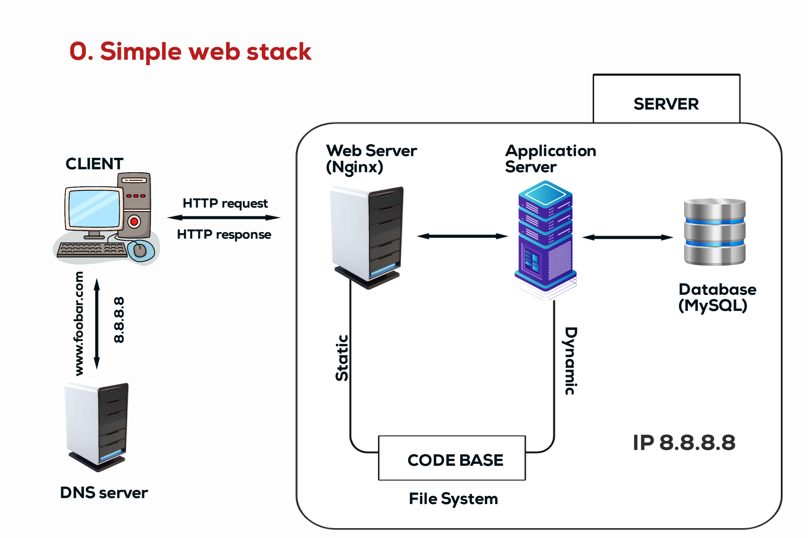
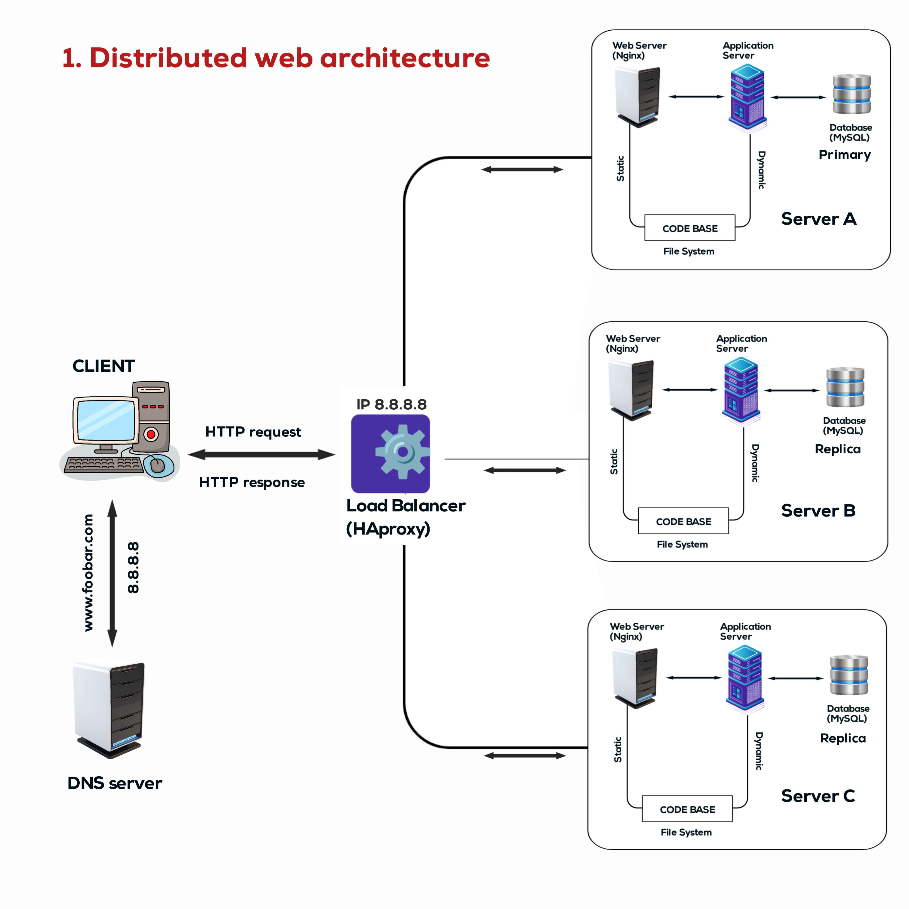
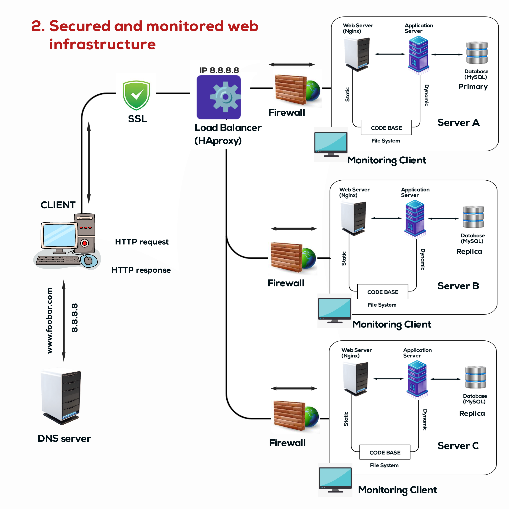
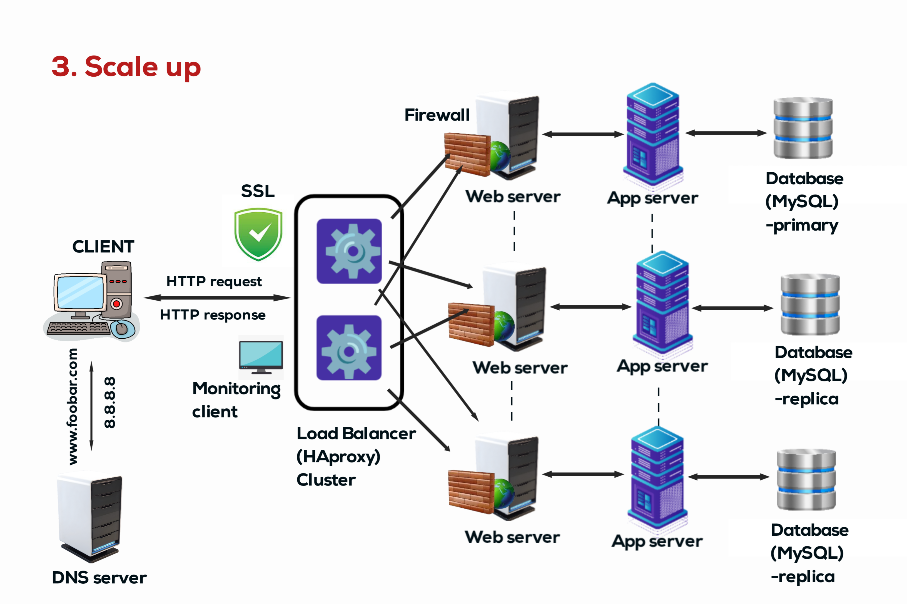

## 0. Simple Web Stack

### Overview
A lot of websites rely on simple web infrastructure, often composed of a single server with a LAMP stack. In this scenario, we design a one-server web infrastructure hosting a website reachable via www.foobar.com.

### Infrastructure Components
- **1 Server:** Hosts all components of the web stack.
- **1 Web Server (Nginx):** Handles incoming HTTP requests and serves static content.
- **1 Application Server:** Executes dynamic application logic.
- **1 Application Files:** Contains the code base of the website.
- **1 Database (MySQL):** Stores website data.

### Explanation
- **Server:** A computer system that provides data or services to other computers or clients.
- **Domain Name:** A human-readable label assigned to an IP address, facilitating easy access to websites.
- **www Record:** A DNS record indicating the hostname www is associated with the domain foobar.com.
- **Web Server:** Receives and fulfills requests from clients (browsers) for web pages.
- **Application Server:** Executes application logic and communicates with the database.
- **Database:** Stores and manages website data.
- **Communication:** The server communicates with the user's computer over the internet using HTTP/S protocols.

### Issues
- **Single Point of Failure (SPOF):** If the server fails, the website becomes inaccessible.
- **Downtime During Maintenance:** Deploying new code requires restarting the web server, resulting in downtime.
- **Scalability Limitation:** Unable to handle large traffic influx efficiently.

## 1. Distributed Web Infrastructure

### Overview
This design expands the infrastructure to accommodate higher traffic and ensure fault tolerance.

### Infrastructure Components
- **2 Servers:** Provides redundancy and load distribution.
- **1 Web Server (Nginx):** Serves static content.
- **1 Application Server:** Executes dynamic application logic.
- **1 Load Balancer (HAproxy):** Distributes incoming traffic across servers.
- **1 Set of Application Files:** Contains website code.
- **1 Database (MySQL):** Stores website data.

### Explanation
- **Additional Elements:** Added for redundancy, load distribution, and fault tolerance.
- **Load Balancer Algorithm:** Configured with a round-robin algorithm, distributing requests evenly.
- **Active-Active vs. Active-Passive:** Active-Active enables both servers to handle traffic simultaneously, while Active-Passive designates one server as active and the other as standby.
- **Primary-Replica Database Cluster:** Primary node handles writes, while replica nodes replicate data for redundancy.
- **Role Difference:** Primary node handles write operations, while replica nodes serve read operations.

### Issues
- **Single Points of Failure (SPOFs):** Load balancer and database are potential SPOFs.
- **Security Concerns:** Lack of firewall and HTTPS encryption exposes the infrastructure to security risks.
- **Monitoring Absence:** No monitoring setup leaves the infrastructure vulnerable to performance issues.

## 2. Secured and Monitored Web Infrastructure

### Overview
Enhanced infrastructure with security measures and monitoring capabilities for improved reliability and performance.

### Infrastructure Components
- **3 Firewalls:** Secures network traffic.
- **SSL Certificate:** Enables HTTPS encryption for secure communication.
- **3 Monitoring Clients:** Collect performance data for analysis.

### Explanation
- **Additional Elements:** Added for security enhancement and performance monitoring.
- **Firewalls:** Control incoming and outgoing network traffic to prevent unauthorized access.
- **HTTPS Encryption:** Secures data transmission between the server and client, protecting against eavesdropping and tampering.
- **Monitoring:** Collects and analyzes performance metrics to ensure optimal system operation.
- **Monitoring Tool Data Collection:** Monitors system metrics such as CPU usage, memory usage, and network traffic.
- **Web Server QPS Monitoring:** Monitor the number of queries per second to gauge server load and performance.

### Issues
- **SSL Termination at Load Balancer:** Termination at this level exposes decrypted data, compromising security.
- **Single MySQL Write Server:** A single point of failure for write operations.
- **Uniform Server Components:** Homogeneous components across servers can lead to widespread failures.

## 3. Scale Up

### Overview
Scaling up the infrastructure by splitting components and configuring load balancers for high availability.

### Infrastructure Components
- **1 Server:** Hosts individual components.
- **1 Load Balancer (HAproxy):** Configured as a cluster for redundancy.

### Explanation
- **Additional Elements:** Added for scalability and high availability.
- **Split Components:** Isolates web server, application server, and database for better resource allocation and management.
- **Load Balancer Cluster:** Ensures continuous availability and distributes traffic efficiently.

### Issues
- **Single Points of Failure:** Despite load balancer clustering, individual components remain potential SPOFs.
- **Resource Management:** Equal distribution of resources across servers might lead to inefficient resource utilization.
- **Scalability Limits:** Scaling might still be constrained by hardware limitations or architectural choices.
